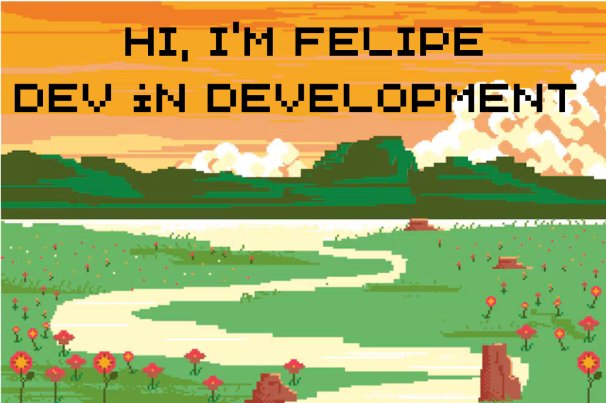

  

  
  

I'm a full stack developer with the weight on the backend, finishing a degree in
Systems Analysis and Development (IFSP, class of 2026).

I work at **EnterScience** building on-demand software for clients — backend, data
modelling and integrations. Day to day that means PHP/Laravel, Node/TypeScript and
Python (Flask, FastAPI), with SQL Server and PostgreSQL underneath.

I came to development the long way around: I worked in finance first, which is
where I learned to read a problem to the end before writing the first line, and to
care about what happens when something breaks in production. Advanced English
certified by Cambridge (B1/B2).

### Technology Stack 🛠️

### What I've been building 🔨

Each of these solves a real problem and documents the trade-offs in its README —
including what I chose *not* to do, and where it would break.

| Project | What makes it worth a look |
| --- | --- |
| **[Monitoramento_APIs](https://github.com/FelipP3reira/Monitoramento_APIs)** | Uptime monitor with scheduled checks and alerts. Spreads work across workers with `FOR UPDATE SKIP LOCKED` — no queue, no Redis. The SSRF guard also blocks the disguises: loopback mapped into IPv6, 6to4 and NAT64. Uptime truncates instead of rounding, and an empty period returns null, not 100%. |
| **[Skill](https://github.com/FelipP3reira/Skill)** | An agent skill that decides whether a prompt change actually helped. The five shortcuts that produce a number which only *looks* rigorous became gates in the code, not advice in the docs. Paired bootstrap, and "within the noise" is a legitimate verdict. |
| **[Gateway_Pagamentos](https://github.com/FelipP3reira/Gateway_Pagamentos)** | Payment gateway sandbox behind a single interface — Stripe, a fake provider and PIX. Explicit state machine, signature-verified webhooks, idempotency that survives a duplicate charge event. The PIX BR Code (EMV + CRC16) is generated for real. |
| **[Sistema_Cache](https://github.com/FelipP3reira/Sistema_Cache)** | Cache library written from scratch in Python: swappable eviction (LRU, LFU in O(1), TTL), two layers kept coherent across instances, and stampede protection. The README compares the policies and says where each one loses. |
| **[Sistema_Filas](https://github.com/FelipP3reira/Sistema_Filas)** | Job queue built by hand on Redis with atomic Lua scripts, retry with backoff, a dead-letter queue and lease-based recovery of stuck jobs. |
| **[Chatbot](https://github.com/FelipP3reira/Chatbot)** | RAG chatbot in FastAPI + pgvector with SSE streaming, provider resilience, and defences against prompt injection and XSS. |

Two more are client work, so the code stays closed: a management system for a
physiotherapy clinic and a dashboard for a personal trainer — both in production.

### Right now 🎯

Going deeper into **Python** — it's the language I enjoy most and where I want to
build the most depth — and into the parts of backend work that only show up under
load: concurrency, data modelling, and what a system does when something fails.
